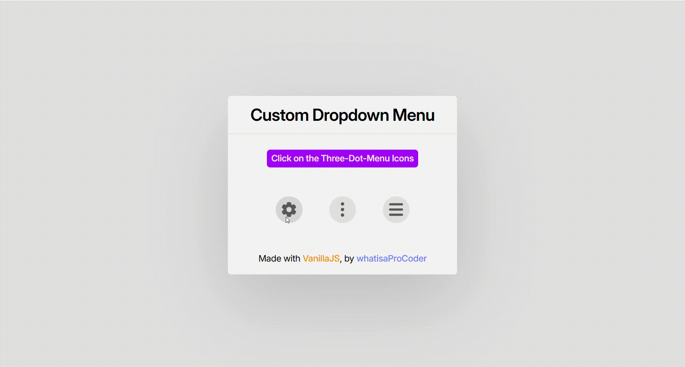

# Custom Dropdown Menu

A lightweight, customizable dropdown menu component with smart positioning and smooth animations.


## Demo



**[Live Demo](https://whatisaprocoder.github.io/custom-dropdown-menu/)** - See the component in action!

## Installation

```bash
npm install @pd200x/custom-dropdown-menu
```

## Quick Start

1. Import the component:

```javascript
import { CustomDropDownMenu, ActionItem } from "@pd200x/custom-dropdown-menu";
```

2. Add a trigger element with an ID:

```html
<button id="menu-trigger">Open Menu</button>
```

3. Create your dropdown menu:

```javascript
const menu = new CustomDropDownMenu({
  menuTitle: "Options",
  triggerElementID: "menu-trigger",
  actionItemArray: [
    new ActionItem("Item 1", () => console.log("Item 1 clicked")),
    new ActionItem("Item 2", () => console.log("Item 2 clicked")),
  ],
  height: "200px",
  width: "180px",
});

menu.setEventListeners();
```

That's it! Your dropdown menu is ready to use.

## Features

- 🎯 **Smart Positioning**: Automatically stays within viewport
- ✨ **Smooth Animations**: Clean fade in/out transitions
- 📱 **Responsive Design**: Works on all screen sizes
- 🖱️ **Click-Away Detection**: Closes when clicking outside
- 📜 **Scrollable Content**: Handles long menus beautifully

## Basic Usage

### Creating a Menu

```javascript
// Import the components
import { CustomDropDownMenu, ActionItem } from "custom-dropdown-menu";

// Create action items with callback functions
const actions = [
  new ActionItem("Save", () => saveDocument()),
  new ActionItem("Delete", () => deleteDocument()),
  new ActionItem("Share", () => shareDocument()),
];

// Create the dropdown menu
const menu = new CustomDropDownMenu({
  menuTitle: "Document Options", // Title shown at the top of the menu
  triggerElementID: "doc-options", // ID of the element that will open the menu
  actionItemArray: actions, // Array of ActionItem objects
  height: "200px", // Height of the menu
  width: "180px", // Width of the menu
  logEvent: true, // Optional: logs events to console
});

// Initialize event listeners
menu.setEventListeners();
```

### ActionItem

The `ActionItem` class creates clickable menu items:

```javascript
new ActionItem(
  "Item Name", // The text displayed in the menu
  () => doSomething(), // Function called when item is clicked
);
```

## API Reference

### CustomDropDownMenu

#### Constructor Options

| Option             | Type         | Required | Description                                       |
| ------------------ | ------------ | -------- | ------------------------------------------------- |
| `menuTitle`        | string       | Yes      | The title displayed at the top of the menu        |
| `triggerElementID` | string       | Yes      | ID of the HTML element that will trigger the menu |
| `actionItemArray`  | ActionItem[] | Yes      | Array of ActionItem objects to display            |
| `height`           | string       | Yes      | Height of the menu (e.g., "200px")                |
| `width`            | string       | Yes      | Width of the menu (e.g., "180px")                 |
| `logEvent`         | boolean      | No       | Enable console logging for events                 |

#### Methods

| Method                | Description                                                     |
| --------------------- | --------------------------------------------------------------- |
| `setEventListeners()` | Initializes the menu's event listeners                          |
| `render()`            | Renders the menu (automatically called when trigger is clicked) |
| `close()`             | Closes the menu with a fade-out animation                       |

### ActionItem

#### Constructor Parameters

| Parameter        | Type     | Description                            |
| ---------------- | -------- | -------------------------------------- |
| `actionName`     | string   | Text displayed in the menu item        |
| `actionFunction` | function | Callback function when item is clicked |

## Examples

### Basic Menu

```javascript
import { CustomDropDownMenu, ActionItem } from "custom-dropdown-menu";

const menu = new CustomDropDownMenu({
  menuTitle: "Settings",
  triggerElementID: "settings-btn",
  actionItemArray: [
    new ActionItem("Profile", () => openProfile()),
    new ActionItem("Preferences", () => openPreferences()),
    new ActionItem("Logout", () => logout()),
  ],
  height: "180px",
  width: "150px",
});

menu.setEventListeners();
```

### Multiple Menus

```javascript
// First menu
const settingsMenu = new CustomDropDownMenu({
  menuTitle: "Settings",
  triggerElementID: "settings-btn",
  actionItemArray: [
    new ActionItem("Account", () => showAccount()),
    new ActionItem("Logout", () => logout()),
  ],
  height: "120px",
  width: "150px",
}).setEventListeners();

// Second menu
const fileMenu = new CustomDropDownMenu({
  menuTitle: "File",
  triggerElementID: "file-btn",
  actionItemArray: [
    new ActionItem("New", () => createNew()),
    new ActionItem("Open", () => openFile()),
    new ActionItem("Save", () => saveFile()),
  ],
  height: "150px",
  width: "150px",
}).setEventListeners();
```

## Styling

The component uses Tailwind CSS classes for styling. The default styling provides a clean, modern look, but you can customize it by overriding the built-in CSS classes.

### Custom CSS Classes

The component includes specific CSS classes to make custom styling easy:

| Class Name        | Element        | Description                                     |
| ----------------- | -------------- | ----------------------------------------------- |
| `cdm-menu-card`   | Menu container | The outer container of the entire dropdown menu |
| `cdm-menu-title`  | Title bar      | The title section at the top of the menu        |
| `cdm-action-item` | Menu items     | Individual clickable items in the menu          |

### Example Custom Styling

```css
/* Style the menu container */
.cdm-menu-card {
  border-radius: 8px !important;
  box-shadow: 0 10px 25px rgba(0, 0, 0, 0.2) !important;
}

/* Style the menu title */
.cdm-menu-title {
  background-color: #4a5568 !important;
  color: white !important;
  font-weight: bold !important;
}

/* Style the menu items */
.cdm-action-item {
  padding: 12px 16px !important;
  transition: background-color 0.2s !important;
}

.cdm-action-item:hover {
  background-color: #f7fafc !important;
  cursor: pointer !important;
}
```

### Using !important

Because the component uses Tailwind CSS internally, you may need to use the `!important` rule to ensure your custom styles override the default styles. This is common when customizing third-party components.

If your custom styles aren't being applied, try adding `!important` to the CSS properties as shown in the example above.

## Dependencies

- [Smooth Scrollbar](https://github.com/idiotWu/smooth-scrollbar): For smooth scrolling in menus with many items

## License

ISC © [Pritam Debnath](https://github.com/whatisaProCoder)
